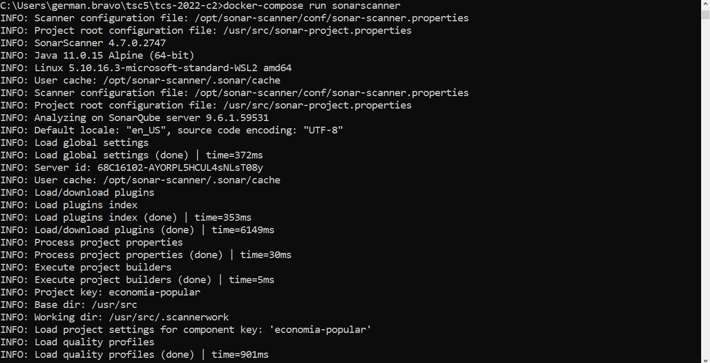
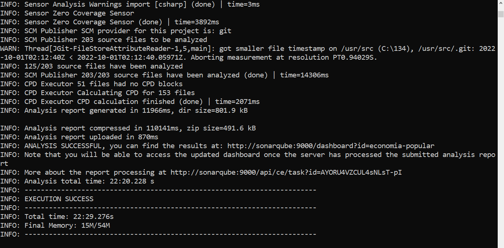
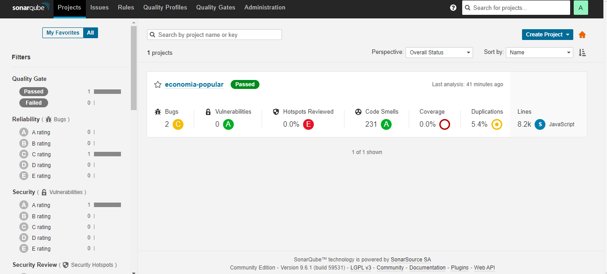
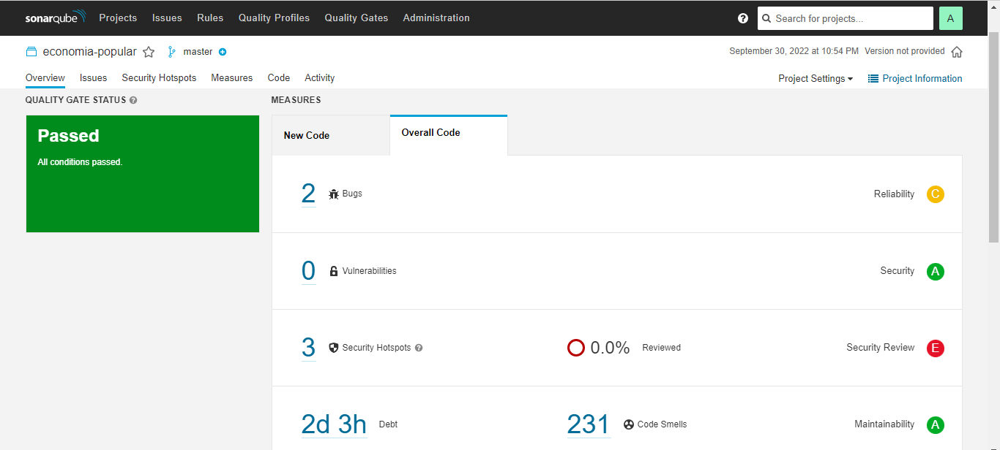
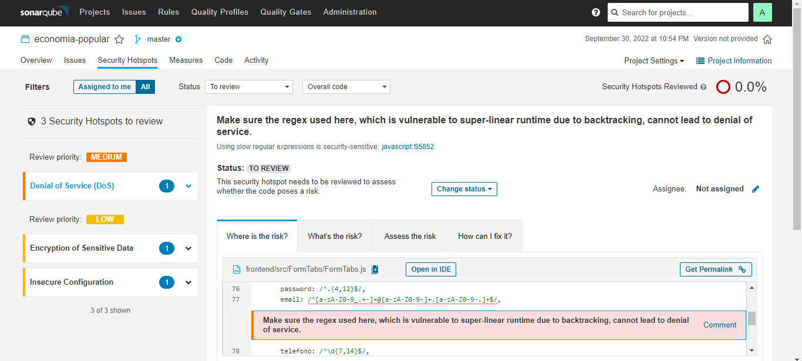

# SonarQube

## Posible problema en Docker Desktop for Windows con su solución

Para poder correr Sonarqube en Docker Desktop, se debe hacer un cambio en el Windows Subsystem for Linux (WSL) en una propiedad.

***
CAMBIO DE FORMA TEMPORAL
***

- Abrir un cmd y ejecutar las siguientes 2 lineas en un cmd/bash/posh:

` 
wsl -d docker-desktop
sysctl -w vm.max_map_count=262144
`

-  Levantar contenedores con docker-compose

***
CAMBIO DE FORMA PERMANENTE
***

- Ejecutar el comando (al ejecutarlo se cerrará Docker Desktop)

`
wsl --shutdown
`

- Editar el archivo:

`
%USERPROFILE%/.wslconfig
`

- Agregar a lo ultimo la siguiente linea:

`
kernelCommandLine="sysctl.vm.max_map_count=262144"
`

- Volver a abrir Docker Desktop, esperar a que inicie y levantar contenedores con docker-compose

## Como ejecutar SonarQube + SonarScanner

Para usar SonarQube, una vez que ya esta activo el servicio, luego de levantar los contenedores y haber cargado todo lo necesario Docker, se debe:

### AUN NO CAMBIAR LAS CREDENCIALES POR DEFECTO

- Ejecutar el servicio de SonarScanner con el siguiente comando:

`
docker-compose run sonarscanner
`

- SonarScanner primero validara que las credenciales a SonarQube sean correctas, basado en el archivo sonar-project.properties, luego analizara todo el proyecto, desde el front hasta el backend, y una vez finalizado todo, subira automaticamente el reporte del análisis al SonarQube.

- Una vez que SonarScanner haya finalizado, ahora si ingresar al dashboard de SonarQube nuevamente en:

http://localhost:9000

- Ingresar con las credenciales admin:admin , y debido a que SonarQube nos lo pide, establecer una nueva contraseña.

- Actualizar esta contraseña en el parametro sonar.password dentro del archivo sonar-project.properties en la raiz del proyecto.

- Una vez que se ha terminado de procesar el reporte en SonarQube ya podrás ver los resultados, con sus detecciones de bugs, vulnerabilidades, sec. hotspots y code smells.

## Proximos pasos

Debido a que ejecutamos SonarQube desde una instalacion limpia en Docker, los Quality Profiles y Quality Gates que utiliza son los predeterminados de SonarQube, como por ejemplo el "Sonar Way".

En caso de querer hilar mas fino activando reglas de análisis de código para las diferentes categorias, no dudar en modificar los Quality Profiles asignados para cada lenguaje, como los que competen a este proyecto tales como JS, YAML, JSON, y luego volver a correr el SonarScanner con:

`
docker-compose run sonarscanner
`

Automaticamente SonarScanner detectara el cambio de Quality Profiles y realizara un análisis tomando como base estos datos.